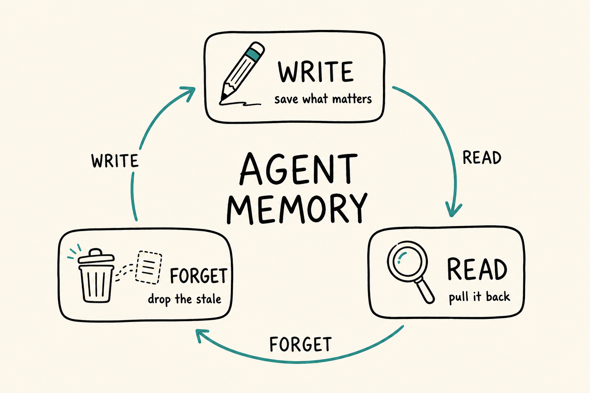
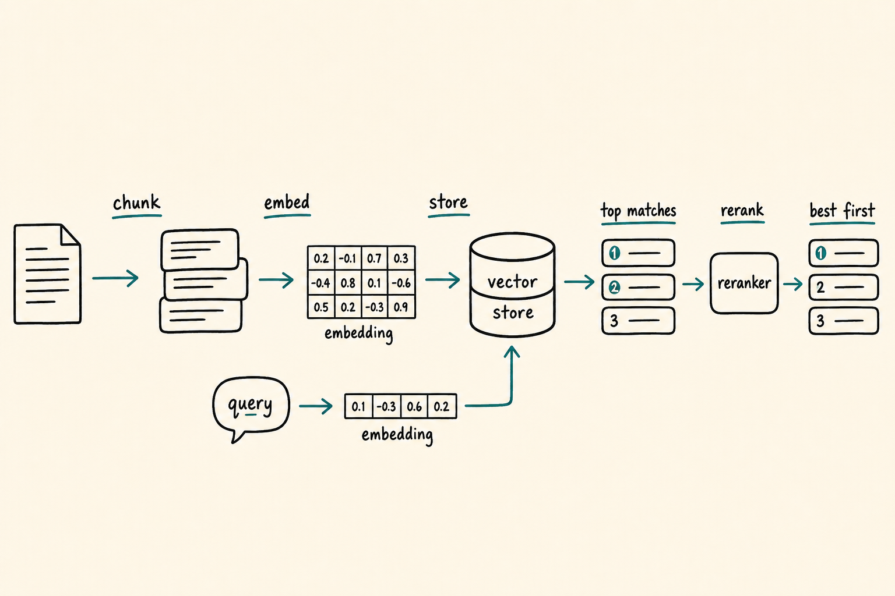
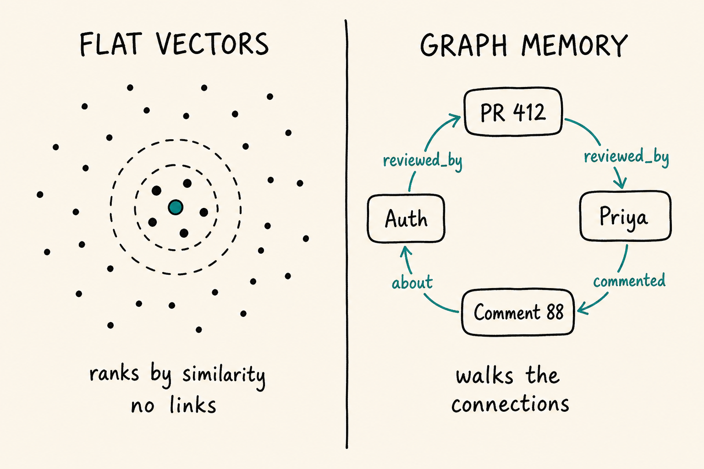
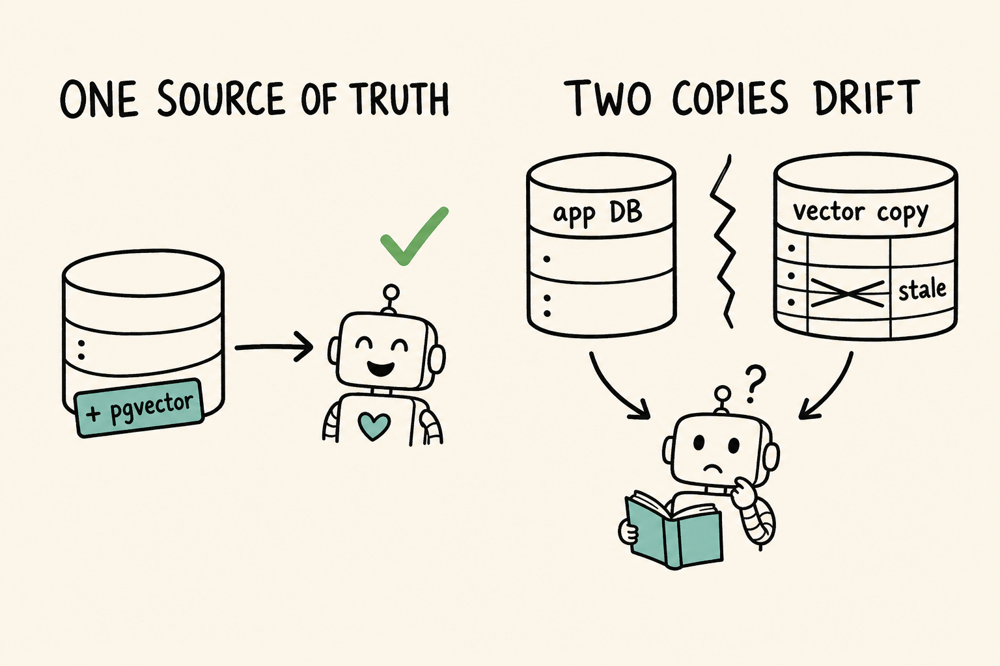

Most "AI memory" tutorials hand you a vector database on page one. Then your agent still forgets things, retrieves nonsense, or uses a fact that stopped being true last week. The storage was never the hard part.

This post starts from the basics and walks up to the parts that bite in production. By the end you can name the kinds of memory an agent needs, pick storage for each, and say how you would know any of it works.

One framing first. A model is stateless. It remembers nothing between calls. Everything it knows in a turn either sits in the prompt you send or arrives from a tool it calls. Memory is the machinery that decides what goes into that prompt. That sentence carries most of this post: memory quality is whatever lands in the context window, not whatever sits in your database.

## What "memory" means

Drop the single word "memory" and use the split from [CoALA](https://arxiv.org/abs/2309.02427), which most agent frameworks now echo:

- **Working memory:** the active context window, the model's scratch space for the current turn.
- **Episodic memory:** past events, what happened in earlier sessions turn by turn.
- **Semantic memory:** facts, like "this user runs Postgres 16 and dislikes default exports."
- **Procedural memory:** how to act, the prompts, tools, and policies that shape behavior.

Most tutorials handle semantic facts and call it done. The other three decide whether an agent feels dumb or sharp.

Across all four, the operations are three verbs ([Nick Lawson](https://towardsdatascience.com/a-practical-guide-to-memory-for-autonomous-llm-agents/) frames them well):

- **Write:** decide what is worth saving.
- **Read:** pull the right thing into the prompt at the right moment.
- **Forget:** drop, expire, or supersede what stopped helping.

Almost every "my agent forgot" bug is a broken Read that fetched the wrong thing, or a missing Forget that let a stale fact win.



## The simplest memory that works

Start dumb on purpose. Append facts to a table, load the relevant ones each turn. That counts as memory.

```sql
-- write
INSERT INTO agent_memory (user_id, fact, created_at)
VALUES ($1, 'prefers TypeScript, dislikes default exports', now());

-- read (naive: most recent N)
SELECT fact FROM agent_memory
WHERE user_id = $1
ORDER BY created_at DESC
LIMIT 20;
```

For a handful of stable facts this is the whole system. It falls apart the moment facts conflict or expire.

The fix is to treat writes as mutations, not an append-only log. A memory row wants more than text:

```sql
CREATE TABLE agent_memory (
  id               bigint PRIMARY KEY,
  user_id          bigint NOT NULL,
  memory_type      text,          -- episodic | semantic | procedural
  fact             text NOT NULL,
  source           text,          -- where it came from, for audit
  confidence       real,
  valid_from       timestamptz,
  valid_until      timestamptz,   -- null means still true
  supersedes_id    bigint,        -- this row replaces an older one
  last_accessed_at timestamptz
);
```

Now Forget is a real operation. Set `valid_until`, or point `supersedes_id` at the row you replaced. You keep history for audit and still read only what holds now.

Two reasons the "stuff everything into the prompt" approach breaks. First, you resend and pay for every token each turn, and that grows without bound. Second, a long context is not free memory. [Lost in the Middle](https://arxiv.org/abs/2307.03172) showed models lean on the start and end of a long prompt and lose the middle. Chroma's [context rot](https://www.trychroma.com/research/context-rot) report pushed on this across 18 models and found accuracy gets less reliable as inputs grow, even on easy tasks. More context can buy worse answers.

So you retrieve instead of dumping. Store each note as a chunk, embed it, fetch the closest few to the question. An embedding is a vector that places similar meaning close together, so "cancel my booking" lands near "I want a refund" with no shared words. With pgvector that ranking stays inside Postgres:

```sql
SELECT fact
FROM agent_memory
WHERE user_id = $1 AND valid_until IS NULL
ORDER BY embedding <=> $query_embedding
LIMIT 5;
```



> **Going deeper.** Top-k similarity ranks by closeness, which can skip the chunk you wanted, because nearest is not most useful. Hybrid retrieval runs keyword search beside vector search so exact terms like an error code or a surname still land, and a reranker re-scores the shortlist with a model that reads query and chunk together. Budget for the real cost too: an embedding on every write, an extraction call to decide what to store, the reranker, prompt tokens on read, and the evals that keep it honest. "Storage plus a lookup" hides most of the bill.

## Always resident vs retrieved

Some memory stays in the prompt every turn, and some gets fetched on demand. Keeping the right facts resident separates a toy from a production agent.

[MemGPT](https://arxiv.org/abs/2310.08560) framed the context window like virtual memory in an operating system. It splits storage into core memory (small, always visible, editable by the agent itself) and archival memory (large, searched when needed), and lets the agent page facts in and out with tool calls. [Letta](https://docs.letta.com/guides/agents/memory-blocks) ships this as memory blocks: labeled context sections that ride in every prompt and that the agent rewrites as it learns. A user's name or the current goal belongs in a block, not in a vector you hope to retrieve.

Anthropic's [memory tool](https://platform.claude.com/docs/en/agents-and-tools/tool-use/memory-tool) is the same idea in a different shape. Claude reads and writes files in a memory directory with plain create, read, update, and delete, while context editing clears old tool results and compaction summarizes older turns to keep the window lean. The shared lesson: choosing what stays resident matters more than how you search the rest.

## Where flat vectors fall down

Vectors rank by similarity. They return text that mentions a relationship, but give you no edge to walk and no sense of what is current.

Picture this: "what did the person who reviewed my PR last month suggest about auth?" Answering means walking a chain. Find the PR, its reviewer, that reviewer's comments, filter to auth. A graph stores those as edges you traverse:

```text
(PR #412) --reviewed_by--> (Priya)
(Priya)   --commented----> (Comment 88)
(Comment 88) --about------> (Auth)
```



The sharper win is time. Facts expire, and "prefer the newest row" is a blunt rule. [Zep's Graphiti](https://help.getzep.com/graphiti) graph is bi-temporal: it records when an event happened and when you learned it, and when a new edge contradicts an old one it marks the old fact invalid rather than deleting it. The agent can answer "what was the shipping status on Tuesday" and "what is it now" from one store.

> **Going deeper.** A graph is only as good as its construction. Entity resolution (is "Priya" the same as "Priya S"?), relation extraction, and temporal parsing all fail in ordinary ways, and a sloppy traversal policy returns confident nonsense. Reach for a graph when connections and currentness are the question, not when similarity already answers it.

## Don't build a new store; ground in what you have

[Rod Johnson](https://medium.com/embabel/agent-memory-is-not-a-greenfield-problem-ground-it-in-your-existing-data-9272cabe1561) argues agent memory is not a greenfield project, and for semantic facts he is right. Your database already holds users, orders, tickets, and history. Stand up a separate vector service beside it and you maintain a second copy of the truth that drifts stale the moment someone edits a row. Add an `embedding` column to a table you already own and semantic recall sits next to data you trust.

The exception is memory your app does not already store: a user's learned preferences, an agent's procedural notes, a running summary of past sessions. Those want their own memory tables and an event log, grounded against your source of truth but kept out of business tables.



> **Going deeper.** Beyond write policy, mature agents consolidate. [Generative Agents](https://arxiv.org/abs/2304.03442) kept a memory stream, retrieved by a blend of recency, importance, and relevance, and synthesized higher-level reflections from raw observations. Summarization is a form of forgetting: you compress many episodic rows into one semantic fact and drop the noise. Decide who writes, how you dedupe, and how you reflect before you turn any of it on.

## Turn automatic writes off by default

A stance worth holding: in production, automatic memory writes should start disabled. If a user cannot see, edit, expire, and audit what the agent remembered, you did not build personalization. You built a persistent prompt-injection surface, where one poisoned input becomes a fact the agent trusts in every later session. Let memory accrete on purpose, with a path to inspect and undo it.

## How to know it works

Memory is testable, and most teams skip it. [LongMemEval](https://arxiv.org/abs/2410.10813) is a useful map: it scores information extraction, multi-session reasoning, temporal reasoning, knowledge updates, and abstention (knowing when it has nothing), and reports commercial assistants losing around 30% accuracy once sustained memory is in play.

A practical eval checklist:

- **Recall@k:** does the right memory make the shortlist?
- **Stale-fact rate:** how often does it answer from an expired row?
- **Conflict resolution:** when two facts disagree, does the current one win?
- **Abstention:** does it say "I don't know" instead of inventing?
- **Latency and token cost:** per turn, at your real memory size.
- **Poisoning:** can a crafted input plant a durable bad memory?

For a sense of the upside, [mem0](https://arxiv.org/abs/2504.19413) reports on its own benchmark a 26% relative quality gain over a leading assistant's built-in memory, around 91% lower p95 latency, and over 90% token savings against replaying full history. Read that as self-reported, and as a sign of how much a real memory layer beats dumping everything into context.

## A short decision guide

Match the store to the question. Read top to bottom, stop at the first row that fits.

| Your agent needs | Use | Why |
|---|---|---|
| a few stable facts | a table plus keyword search | retrieval adds nothing yet |
| semantic recall over docs or chats | vectors, add a reranker if recall is weak | meaning beats exact words |
| answers about how things relate | a graph, or a graph beside vectors | edges you can walk |
| facts that change over time | a bi-temporal graph or versioned rows | currentness, with history |
| facts already in your database | ground there and add pgvector | one source of truth |

Storage is one axis. Weigh the query shape, how fast facts go stale, who may write, and whether you can audit what was stored.

## Wrapping up

Memory is four kinds (working, episodic, semantic, procedural) and three verbs (write, read, forget). A vector database is one tool for one verb on one kind. The hard parts are deciding what stays resident in the prompt, keeping facts current, and proving any of it works.

Hold onto the one line: memory quality is whatever lands in the context window, not whatever sits in storage. In the next post I zoom out to the machine around it, the harness that runs the agent loop, and why the right harness often beats a bigger model.
